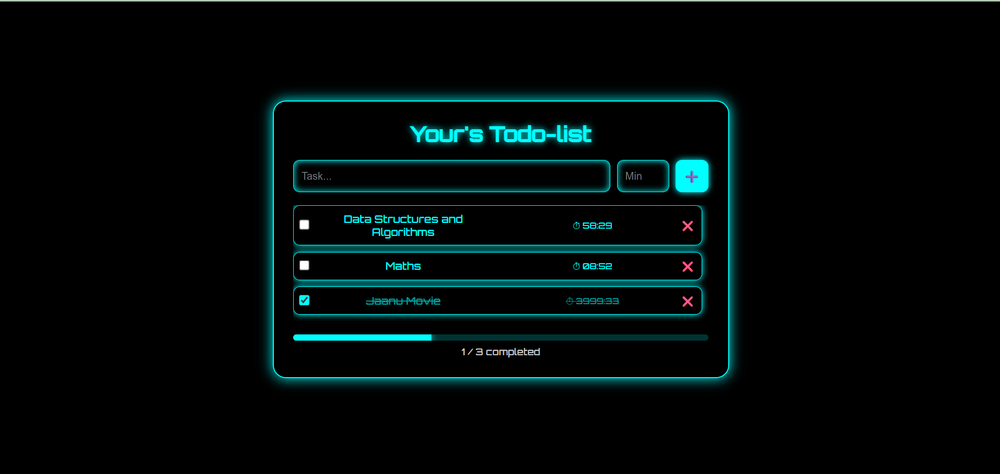

# 📝 Modern To-Do List App

A stylish, user-friendly task management web application built using **HTML**, **CSS**, and **JavaScript**. It helps users organize their daily tasks with features like live countdown timers, a progress tracker, and task editing.

---

## 🚀 Features

- ✅ Add, edit, delete, and mark tasks as complete
- ⏰ Set timers with reminder alerts
- 📊 Live progress bar that updates as you complete tasks
- 💾 Tasks saved in local storage (no backend needed)
- 🎯 Minimal, neon-inspired UI design
- 📱 Responsive layout (mobile/tablet friendly)

---

## 🛠 Tech Stack

- **Frontend**: HTML, CSS, JavaScript
- **Storage**: LocalStorage

---

## 📸 Screenshots



---

## 🔧 Setup Instructions

```bash
# Clone the repository
https://github.com/bhavya970/Modern_Todo_List_App.git

# Open index.html in your browser
```

No installation needed — it's 100% frontend!

---

## 📂 Folder Structure

```
Modern_Todo_List_App/
├── index.html
├── style.css
└── script.js
```

---

## 📄 License

This project is open source and available under the [MIT License](LICENSE).

---

## 🙋‍♀️ Author

**Bhavya Sree**  
GitHub: [@bhavya970](https://github.com/bhavya970)

---

> Made with ❤️ to keep your tasks on track!
